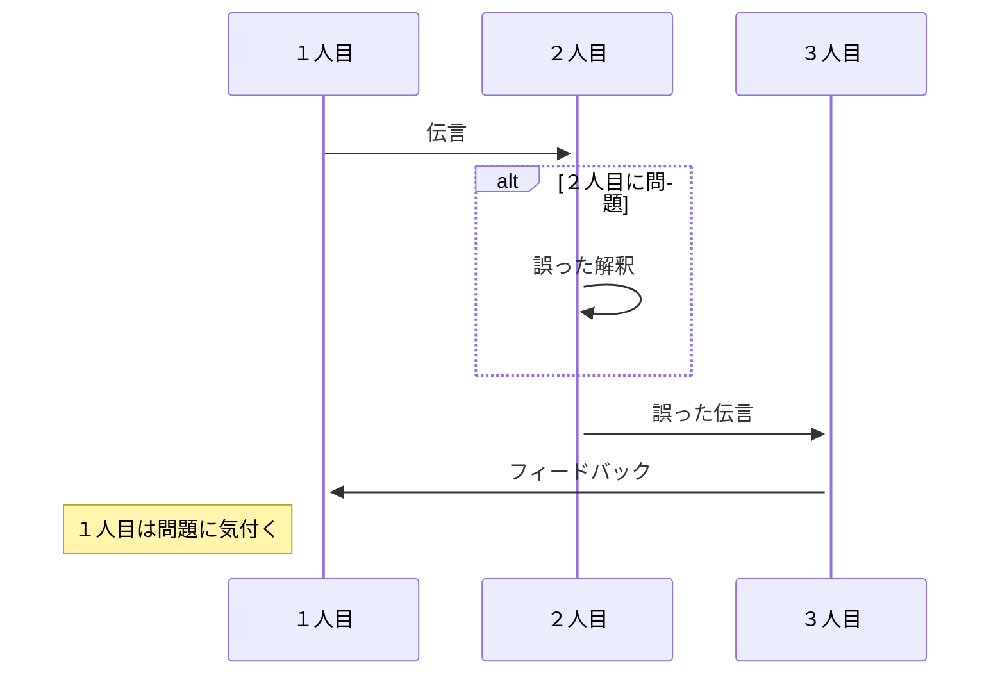

# 2022Test

```mermaid
sequenceDiagram
participant 1 as １人目
participant 2 as ２人目
participant 3 as ３人目

1->>+2: 伝言
alt ２人目に問題
2->>2: 誤った解釈
end
2->>+3: 誤った伝言
3->>+1: フィードバック

Note left of 1: １人目は問題に気付く
```
